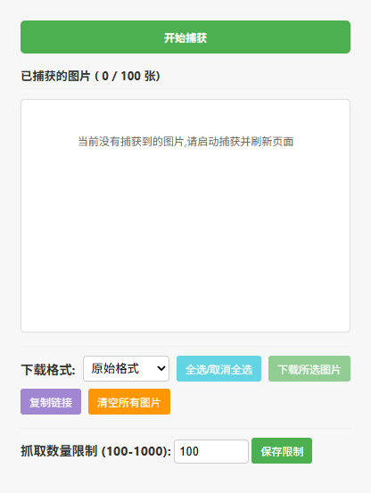

# ImageDown

## 📑简介
一个轻量的浏览器扩展，用于批量抓取并下载网页中的图片，支持将图片打包为 ZIP 文件并一次性保存到本地。适用于需要批量保存网页图片的场景(例如图库、商品图、博客图集等)。

**主要功能**
- 一键扫描当前页面上的图片资源
- 双击可以放大查看图片
- 选择性下载(选中要下载的图片或全部下载)
- 图片打包为 ZIP 下载
- 导出图片链接(复制到剪切板)

## ⬇️安装
1. 在 Releases 界面下载最新的 zip 格式的压缩包
2. 解压 zip 格式的压缩包
2. 在浏览器中打开扩展管理页面：`chrome://extensions` 或 `edge://extensions`。
3. 启用右上角的"开发者模式"。
4. 点击"加载已解压的扩展程序(Load unpacked)",选择本项目目录(包含 `manifest.json` 的文件夹)
5. 安装后会在工具栏出现扩展图标,点击即可使用

## 🔍 界面
